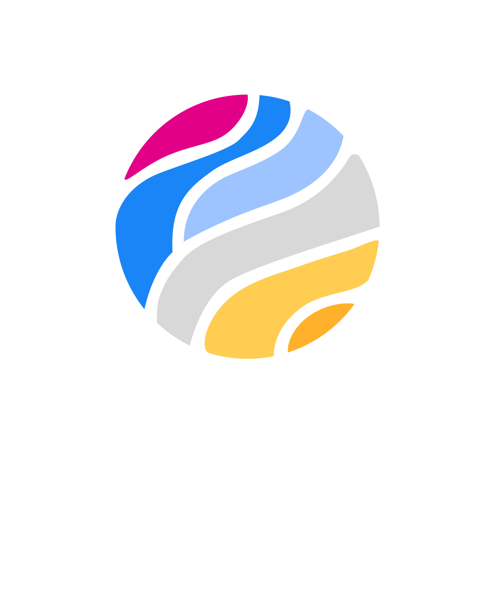

<!-- banner -->

                                                                                                                                                                         
  

 

<!-- badges -->

 

Granite is a custom ECS framework implemented in pure Kotlin/JVM, with built-in support for coroutines and parallel
processing of entity data. It is heavily inspired by [Flecs](https://github.com/SanderMertens/flecs), a fast,
lightweight ECS implemented in C, and most of the indexing and storage methods are based on a
[series of articles](https://ajmmertens.medium.com/building-an-ecs-1-where-are-my-entities-and-components-63d07c7da742)
written by the author of Flecs.

## Under construction

This project is still very experimental, API stability is not guaranteed (though efforts will be made to avoid major breaking changes). More documentation will be added in the future to improve the onboarding experience (stay tuned! 🙂), in the meantime, checking out the README for each of the subprojects may help.